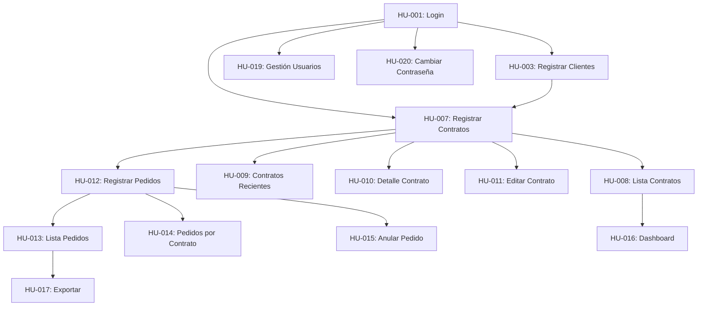

# Plan de Implementación - OV-APP

## Resumen Ejecutivo
Sistema de gestión de contratos y pedidos de venta para empresa de aceite de palma, desarrollado con React, Vite, TypeScript y Material-UI.

## Arquitectura Técnica

### Stack Tecnológico
- **Frontend:** React 18 + TypeScript + Vite
- **UI Framework:** Material-UI (MUI) v5
- **Base de Datos:** IndexedDB (Dexie.js) para almacenamiento local
- **Autenticación:** JWT con almacenamiento en localStorage
- **Estado Global:** Context API + useReducer
- **Routing:** React Router v6
- **Validación:** React Hook Form + Yup
- **Testing:** Vitest + React Testing Library
- **Linting:** ESLint + Prettier

## Fases de Implementación

### FASE 1: Configuración Base y Autenticación (Sprint 1)
**Duración:** 1 semana
**Historias:** HU-001, HU-002

#### Tareas Técnicas:
1. **Inicialización del Proyecto**
   - Crear proyecto con Vite + React + TypeScript
   - Configurar ESLint y Prettier
   - Configurar estructura de carpetas
   - Instalar y configurar Material-UI
   - Configurar React Router

2. **Sistema de Autenticación**
   - Crear componente de Login
   - Implementar Context de autenticación
   - Configurar rutas protegidas
   - Implementar persistencia de sesión
   - Crear componente de Layout principal

**Entregables:**
- Aplicación base funcionando
- Sistema de login/logout operativo
- Rutas protegidas configuradas

---

### FASE 2: Gestión de Clientes (Sprint 2)
**Duración:** 1 semana
**Historias:** HU-003, HU-004, HU-005, HU-006

#### Tareas Técnicas:
1. **Configuración de Base de Datos**
   - Instalar y configurar Dexie.js
   - Crear esquema de base de datos
   - Implementar capa de servicios para DB

2. **Módulo de Clientes**
   - Crear modelo de datos Cliente
   - Implementar CRUD de clientes
   - Crear formulario de registro/edición
   - Implementar tabla con búsqueda y filtros
   - Validaciones de formulario

**Entregables:**
- Base de datos local configurada
- CRUD completo de clientes
- Interfaz de gestión de clientes

---

### FASE 3: Gestión de Contratos - Parte 1 (Sprint 3)
**Duración:** 1.5 semanas
**Historias:** HU-007, HU-008, HU-009

#### Tareas Técnicas:
1. **Modelo de Contratos**
   - Crear esquema de contratos en DB
   - Implementar generador de número correlativo
   - Crear servicios de contratos

2. **Interfaz de Contratos**
   - Formulario de creación de contratos
   - Lista de contratos con filtros
   - Vista de contratos recientes
   - Implementar cálculos automáticos

**Entregables:**
- Registro de nuevos contratos
- Listado y búsqueda de contratos
- Dashboard de contratos recientes

---

### FASE 4: Gestión de Contratos - Parte 2 (Sprint 4)
**Duración:** 1 semana
**Historias:** HU-010, HU-011

#### Tareas Técnicas:
1. **Detalles y Edición**
   - Vista detallada de contrato
   - Edición condicional de contratos
   - Indicadores de progreso
   - Validaciones de negocio

**Entregables:**
- Vista completa de detalle de contrato
- Funcionalidad de edición con restricciones

---

### FASE 5: Gestión de Pedidos de Venta (Sprint 5)
**Duración:** 1.5 semanas
**Historias:** HU-012, HU-013, HU-014, HU-015

#### Tareas Técnicas:
1. **Modelo de Pedidos**
   - Esquema de pedidos en DB
   - Relación con contratos
   - Lógica de actualización de volúmenes

2. **Interfaz de Pedidos**
   - Formulario de registro de pedidos
   - Validaciones de volumen disponible
   - Lista de pedidos con filtros
   - Funcionalidad de anulación
   - Actualización automática de contratos

**Entregables:**
- CRUD completo de pedidos
- Integración con contratos
- Manejo de anulaciones

---

### FASE 6: Dashboard y Reportes (Sprint 6)
**Duración:** 1 semana
**Historias:** HU-016, HU-017

#### Tareas Técnicas:
1. **Dashboard Principal**
   - Implementar widgets de métricas
   - Gráficos con Chart.js o Recharts
   - Cálculos de KPIs

2. **Exportación de Datos**
   - Implementar exportación a CSV/Excel
   - Generación de reportes
   - Filtros aplicables a exportación

**Entregables:**
- Dashboard con métricas principales
- Funcionalidad de exportación de datos

---

### FASE 7: Configuración y Administración (Sprint 7)
**Duración:** 1 semana
**Historias:** HU-018, HU-019, HU-020

#### Tareas Técnicas:
1. **Módulo de Configuración**
   - Pantalla de configuración del sistema
   - Gestión de parámetros

2. **Gestión de Usuarios**
   - CRUD de usuarios
   - Asignación de roles
   - Cambio de contraseña

**Entregables:**
- Panel de administración
- Gestión completa de usuarios
- Configuración del sistema

---

### FASE 8: Testing y Optimización (Sprint 8)
**Duración:** 1 semana

#### Tareas Técnicas:
1. **Testing**
   - Pruebas unitarias de componentes críticos
   - Pruebas de integración
   - Pruebas de rendimiento

2. **Optimización**
   - Lazy loading de rutas
   - Optimización de queries a DB
   - Mejoras de UX
   - Responsive design

**Entregables:**
- Suite de pruebas
- Aplicación optimizada
- Documentación técnica

## Dependencias entre Historias

## Estimación de Esfuerzo

| Fase | Historias | Duración | Complejidad |
|------|-----------|----------|-------------|
| 1 | HU-001, HU-002 | 1 semana | Media |
| 2 | HU-003 a HU-006 | 1 semana | Media |
| 3 | HU-007 a HU-009 | 1.5 semanas | Alta |
| 4 | HU-010, HU-011 | 1 semana | Media |
| 5 | HU-012 a HU-015 | 1.5 semanas | Alta |
| 6 | HU-016, HU-017 | 1 semana | Media |
| 7 | HU-018 a HU-020 | 1 semana | Media |
| 8 | Testing | 1 semana | Media |

**Total: 8 semanas (2 meses)**

## Riesgos y Mitigaciones

| Riesgo | Probabilidad | Impacto | Mitigación |
|--------|--------------|---------|------------|
| Complejidad en sincronización de volúmenes | Alta | Alto | Pruebas exhaustivas, validaciones estrictas |
| Rendimiento con grandes volúmenes de datos | Media | Medio | Paginación, índices en DB, lazy loading |
| Pérdida de datos locales | Baja | Alto | Implementar backup/export periódico |
| Cambios en requerimientos | Media | Medio | Desarrollo modular, arquitectura flexible |

## Criterios de Aceptación Globales

1. **Rendimiento:** Carga de páginas < 2 segundos
2. **Responsividad:** Funcional en desktop y tablet
3. **Usabilidad:** Interfaz intuitiva siguiendo Material Design
4. **Confiabilidad:** Sin pérdida de datos, validaciones robustas
5. **Mantenibilidad:** Código documentado, arquitectura clara
6. **Testing:** Cobertura mínima del 70%

## Definición de "Hecho" (DoD)

Una historia se considera completa cuando:
- [ ] Código implementado y funcionando
- [ ] Pruebas unitarias escritas y pasando
- [ ] Code review aprobado
- [ ] Sin errores de linting
- [ ] Documentación actualizada
- [ ] Merge a rama principal
- [ ] Probado en navegadores objetivo